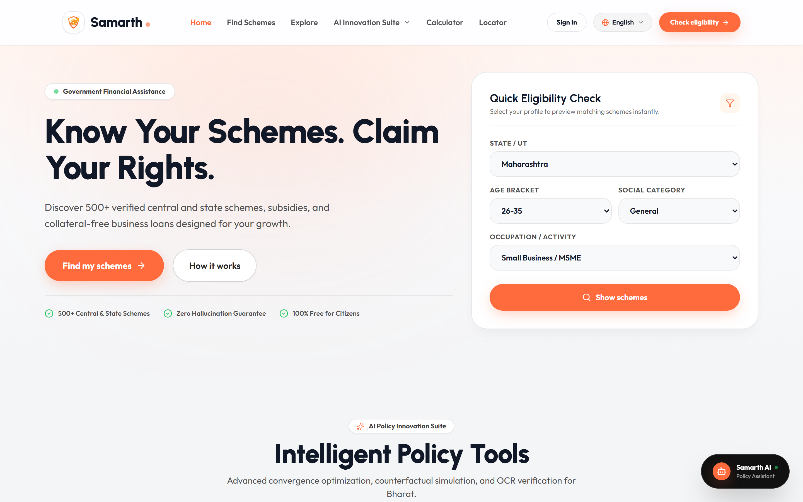
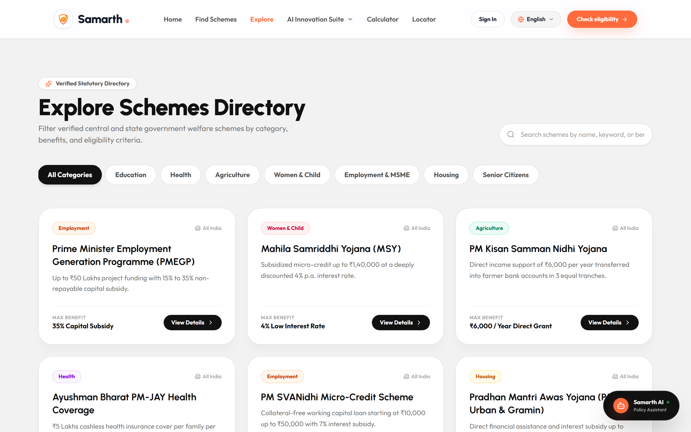
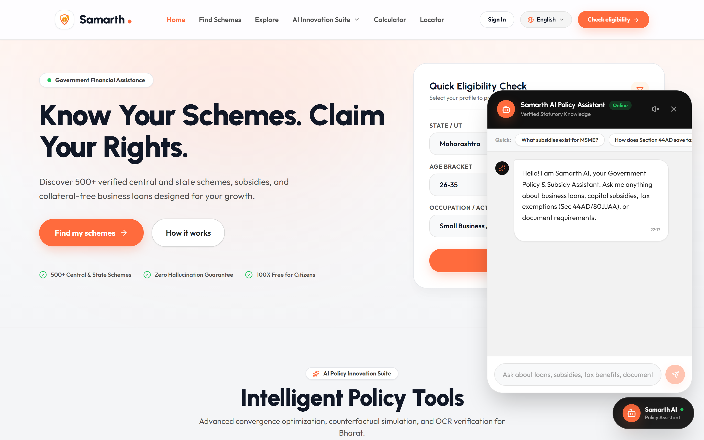
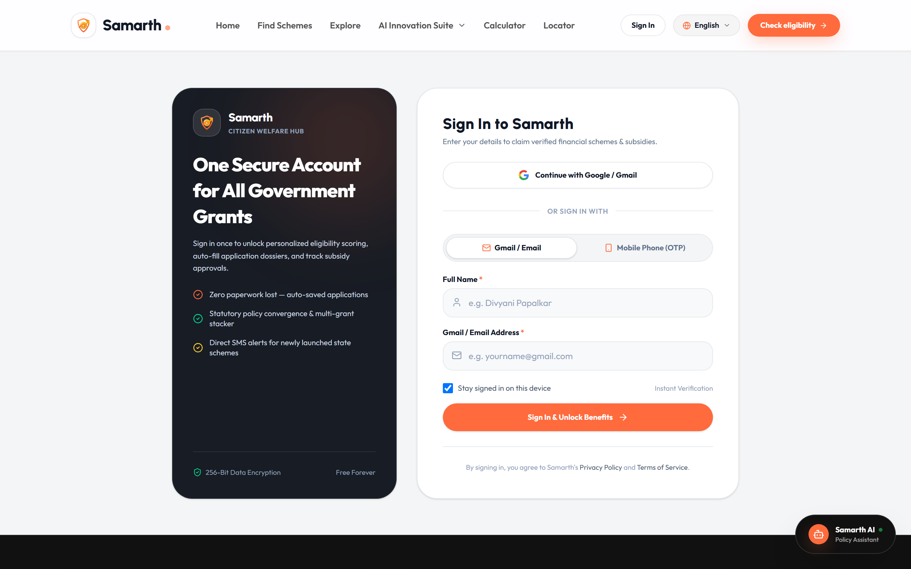
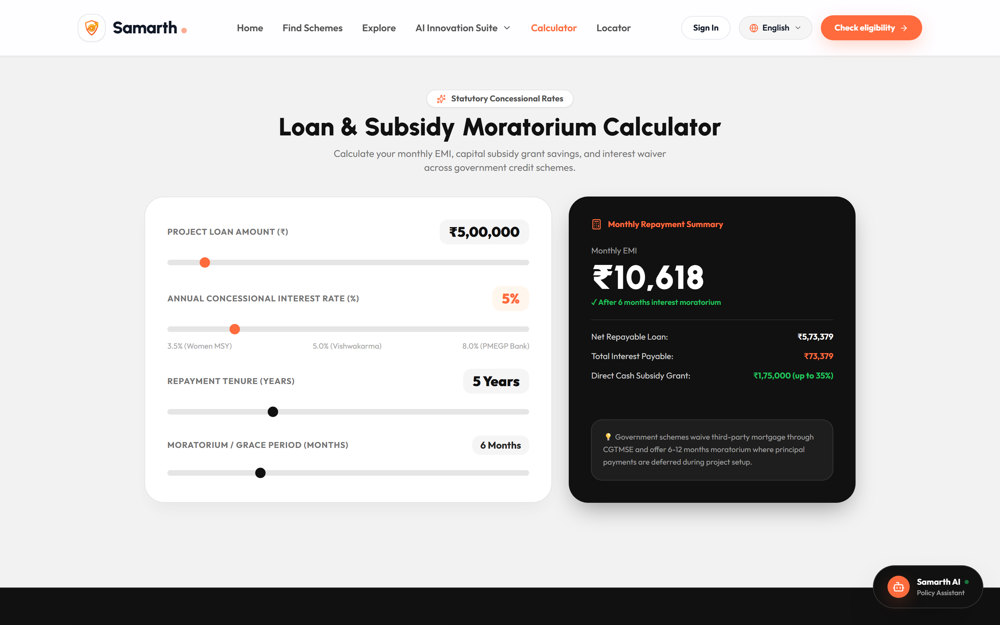
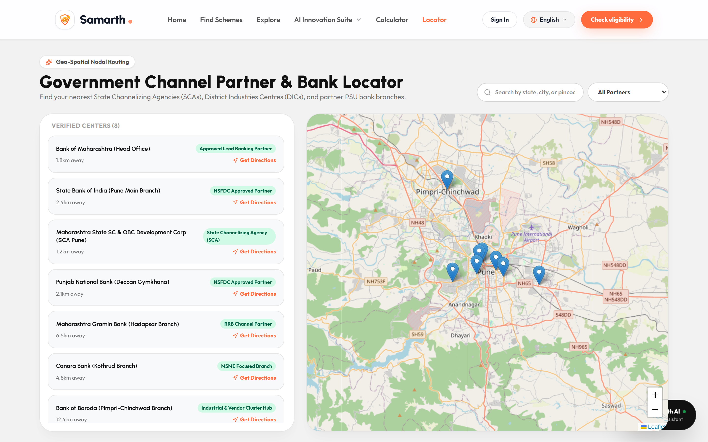

# Samarth (समर्थ) — National Welfare & Policy AI Platform

<div align="center">

[](https://samarth-welfare.vercel.app)
[](https://react.dev/)
[](https://tailwindcss.com/)
[](LICENSE)
[](#multilingual-support)

**"Know Your Schemes. Claim Your Rights."**  
*A modern Bento-Grid AI platform enabling Indian citizens and marginalized entrepreneurs to discover, verify, stack, and claim verified government financial assistance with total transparency.*

[🌐 Live Website](https://samarth-welfare.vercel.app) • [📋 Schemes Directory](https://samarth-schemes.vercel.app) • [🏛️ Citizen Portal](https://samarth-portal.vercel.app)

</div>

---

## 📸 Screenshots Showcase

### 1. Modern Bento Hero & Quick Eligibility Engine
> Warm high-contrast hero interface with instant profile matching, official verified gazette badge, and clean single-card eligibility finder.



---

### 2. Verified Schemes Directory
> Sector-categorized directory (Education, Health, Agriculture, Women & Child, MSME, Housing, Senior Citizens) with benefit highlights and direct drawer modal triggers.



---

### 3. Multilingual AI Policy & Subsidy Assistant
> Floating policy chatbot with offline statutory knowledge base answering in English, Hindi, and Marathi with Web Speech voice input and text-to-speech narration.



---

### 4. Citizen Sign In & Authentication Portal
> Unified sign-in featuring one-click Google/Gmail authentication alongside Indian Mobile Phone SMS OTP verification with applicant name personalization.



---

### 5. Concessional Loan & Moratorium Grace Calculator
> Real-time mathematical simulation calculating monthly EMIs, capital subsidy savings (up to 35%), interest subventions, and moratorium grace periods.



---

### 6. Geospatial SCA & Public Sector Bank Locator
> Interactive Leaflet map and proximity list routing citizens to nearest District Industries Centres (DICs), State Channelizing Agencies, and partner PSU bank branches with Google Maps GPS directions.



---

## 🎨 Design System & UI/UX Principles

Samarth was engineered following a strict modern **Bento-Grid** design system inspired by top SaaS benchmarks:

- **Bento Grid Architecture:** Clean modular cards with very large rounded corners (`rounded-[28px]` to `rounded-[32px]`).
- **Depth & Shadows:** Soft subtle shadows (`shadow-bento-soft`) on light cards, paired with rich charcoal dark cards (`#1E1E1E`) and vibrant orange button glows (`#FF6B3D`).
- **Color Palette:**
  - **Dominant Accent:** `#FF6B3D` (Vibrant Indian Saffron Orange for primary actions, badges, and chart highlights).
  - **Secondary Accents:** Warm Yellow (`#F5E51B`), Success Green (`#22C55E`), Soft Blue (`#4C7CF3`), Lavender (`#A78BFA`), and Emerald (`#10B981`).
  - **Dark Cards:** `#111111` and `#1E1E1E` with subtle white borders (`border-white/10`).
  - **Light Sections:** Clean soft gray canvas (`#F2F2F2` / `#F4F5F7`) with crisp white surface cards (`#FFFFFF`).
- **Typography:** Urbanist & Outfit Google Fonts. Headings set between 48px–64px bold with tight letter-tracking.
- **Micro-Interactions:** Pill-shaped solid buttons, smooth slide-in drawers, animated stat counters, and accessible tab toggles.

---

## 🌐 Full Multilingual Support (English, हिंदी, मराठी)

Samarth offers universal, end-to-end trilingual localization. When toggling the language dropdown in the navigation bar:
- **Every interface string, form label, category filter, badge, and CTA** instantly translates.
- **AI Policy Assistant** switches greeting, prompt suggestions, offline statutory logic, and native Text-to-Speech voices (`hi-IN`, `mr-IN`, `en-IN`).
- **Centralized Dictionary:** Clean modular localization dictionary located in [`src/data/uiTranslations.js`](src/data/uiTranslations.js).

---

## 🚀 Key Modules & Capabilities

### 1. 7-Step Scheme Discovery Wizard (`/find`)
- Step-by-step interactive questionnaire collecting state domicile, age group, social category, annual turnover, and required loan capital.
- Instant percentage match scoring with statutory clause citations and document requirement matrices.

### 2. AI Innovation Suite
- **Policy Stacking & Convergence Optimizer (`/optimizer`):** Combine non-conflicting central and state benefits (e.g. PMEGP 35% capital grant + CGTMSE collateral-free guarantee + Section 44AD presumptive tax relief) to legally maximize assistance.
- **Path to Eligibility Simulator (`/simulator`):** Counterfactual *"What-If"* engine highlighting minimal credential adjustments needed to unlock higher subsidies.
- **AI Business Idea Analyzer (`/analyze`):** Converts informal venture concepts into bank-defensible capital allocation plans and license checklists using Google Gemini.
- **Certificate OCR Scanner (`/scan`):** Client-side document vision scanner extracting name, caste, and income data without manual typing.
- **3-State Evaluation Test Bench (`/testbench`):** Deterministic benchmark proving rule consistency across standard applicant personas.

### 3. Bank-Defensible Application Dossier
- Generates a standardized, printable A4 verification slip with official application seals (`SAMARTH-2026-XXXXX`), verified checklists, and partner bank routing to prevent last-mile counter rejections.

---

## 🛠️ Tech Stack & Architecture

| Layer | Technology |
|---|---|
| **Frontend Framework** | React 19, Vite 8, React Router v7 |
| **Styling & System** | Tailwind CSS v4, Urbanist / Outfit Typography |
| **Icons & Visuals** | Lucide React, Custom Geometric SVG Finance Logo |
| **Geospatial Mapping** | React Leaflet, OpenStreetMap, Leaflet v1.9 |
| **AI & Document OCR** | Google Gemini 2.5 Flash (`@google/generative-ai`) |
| **Voice & Speech** | Web Speech API (Native STT & SpeechSynthesis TTS) |
| **Testing** | Playwright Test Suite (`tests/critical-journeys.spec.js`) |
| **Hosting & Edge** | Vercel Edge Network with Single-Page Application (SPA) Rewrites |

---

## 💻 Local Development Setup

### Prerequisites
- [Node.js](https://nodejs.org/) (v18 or higher recommended)
- `npm` or `yarn`

### Installation Steps

1. **Clone the repository:**
   ```bash
   git clone https://github.com/divyani-22/samarth_welfare.git
   cd samarth_welfare/SchemeSetu
   ```

2. **Install dependencies:**
   ```bash
   npm install
   ```

3. **Configure Environment Variables (Optional):**
   Create a `.env` file in the project root:
   ```env
   VITE_GEMINI_API_KEY=your_gemini_api_key_here
   ```

4. **Start the local development server:**
   ```bash
   npm run dev
   ```
   Open [http://localhost:5173](http://localhost:5173) in your browser.

5. **Run Critical User Journey Tests:**
   ```bash
   npx playwright test --project=chromium
   ```

6. **Create Production Build:**
   ```bash
   npm run build
   ```

---

## 📦 Deployment Configuration (`vercel.json`)

To enable client-side single-page routing without 404 errors on subroutes:

```json
{
  "$schema": "https://openapi.vercel.sh/vercel.json",
  "rewrites": [
    {
      "source": "/api/(.*)",
      "destination": "/api/$1"
    },
    {
      "source": "/((?!api/).*)",
      "destination": "/index.html"
    }
  ]
}
```

---

## 👥 Authors & Acknowledgments

- **Lead Developer:** [Divyani Papalkar](https://github.com/divyani-22) (`divyanipapalkar22@gmail.com`)
- **Repository:** [https://github.com/divyani-22/samarth_welfare](https://github.com/divyani-22/samarth_welfare)
- **Official Open Data Sources:** [myScheme.gov.in](https://www.myscheme.gov.in/), Ministry of MSME, NSFDC, NBCFDC, NSKFDC, and Stand-Up India.

---

<div align="center">
  <sub>Built with ❤️ for Indian Citizens & Entrepreneurs • Open Data Compliant • Samarth National Welfare Infrastructure 2026</sub>
</div>
